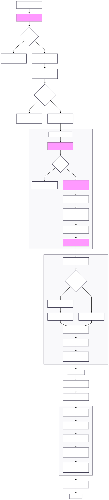

```mermaid
flowchart TD
A[Inicio: usuario selecciona carpeta de musica] --> B[Abrir selector de carpeta DirectoryChooser]
B --> C{Carpeta valida?}
C -- No --> D[Mostrar mensaje No se ha seleccionado ninguna carpeta y terminar]
C -- Si --> E[Guardar ruta de carpeta en ConfigManager para recordar ultima carpeta]
E --> F[Buscar subcarpetas segun tipo de archivo FLAC_HI_RES, FLAC_CD, M4A]
F --> G{Subcarpeta existe?}
G -- No --> H[Mostrar mensaje No se encontro la carpeta para tipo de archivo]
G -- Si --> I[Añadir subcarpeta al mapa subFolders con tipo de archivo como clave]
I --> J[Poblar tabla de canciones]

    subgraph PopulateTable["populateTable"]
        J --> K[Cargar cache de canciones desde JsonCache]
        K --> L{Cache valida?}
        L -- Si --> M[Llenar tabla con canciones de cache sin releer tags]
        L -- No --> N[Crear songMap mapa de canciones por nombre base y RatingManager]
        N --> O[Recorrer cada carpeta de tipo de archivo]
        O --> P[Obtener lista de archivos de musica y sus portadas con ListFiles.listFilesWithCover]
        P --> Q[Recorrer cada archivo de musica con su portada]
        Q --> R[Procesar cada archivo de musica]
    end

    subgraph ProcessFile["processFile"]
        R --> S1[Obtener nombre base del archivo sin extension]
        S1 --> S2{Existe en songMap?}
        S2 -- No --> S3[Crear objeto SongFile y leer tags de artista y album]
        S3 --> S4[Asignar rating desde RatingManager si existe]
        S2 -- Si --> S5[Usar objeto SongFile existente]
        S4 --> S6[Asignar cover si no tiene portada aun]
        S5 --> S6
        S6 --> S7[Agregar version segun tipo de archivo]
        S7 --> S8[Actualizar archivo preferido segun prioridad de versiones]
    end

    S8 --> T[Fin de processFile]
    T --> U[Convertir songMap valores a lista de SongFile]
    U --> V[Guardar lista en JsonCache para futuras cargas]
    V --> W[Llenar tabla de la interfaz con lista de canciones]

    subgraph SetTable["setTable"]
        W --> W1[Ordenar canciones alfabeticamente por nombre]
        W1 --> W2[Crear ObservableList para TableView]
        W2 --> W3[Configurar columnas fileName, artist, album, versions, rating]
        W3 --> W4[Asignar lista a TableView para mostrar todas las canciones]
    end

    W4 --> X[Tabla completamente poblada y visible al usuario]
    X --> Y[Fin del flujo]

    %% Explicaciones importantes
    classDef info fill:#f9f,stroke:#333,stroke-width:1px,color:#000;
    B:::info
    K:::info
    N:::info
    R:::info
```

